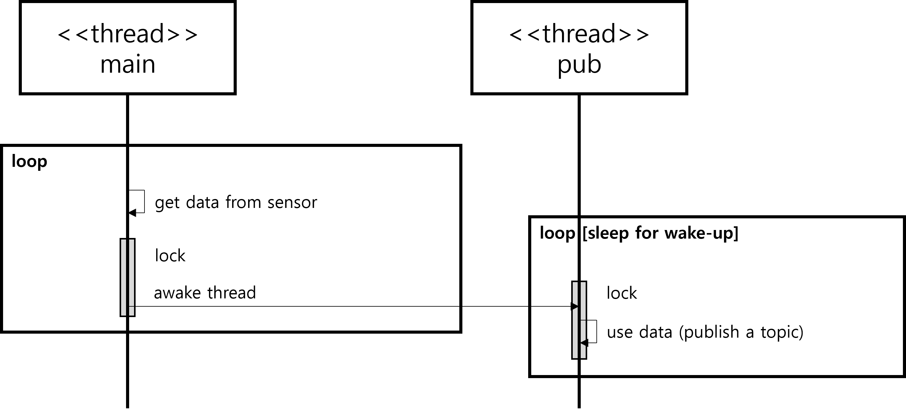
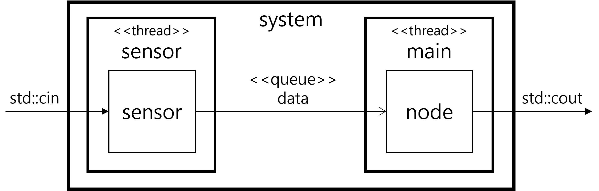

# sensor-node

## Overview

`sensor-node` is a simple C++ program that simulates a sensor node. The program initializes a sensor, continuously polls for data input, and publishes the data to a topic.



Two threads are running concurrently and share data. But the created buffer in circular queue is re-used. Therefore, no more additional copy is required.

```
$ sensor-node
1
Data processed
2
Data processed
publish topic - 1
3
Data processed
publish topic - 2
publish topic - 3
```

## Design Issue
Sensor object is executed by main-thread and pub-thread. poll() and getSensorData() should only be executed by main-thread, and publish() should only be executed by pub-thread. Since one object is used by multiple threads, it is easy to cause a racing condition by incorrectly using member variables and functions.

This also violates SRP (Single Responsibility Principle) by not distinguishing between the responsibility of acquiring data from the sensor and the responsibility of publishing a topic.



## Project Structure

- `CMakeLists.txt`: CMake configuration file for building the project.
- `inc/sensor.hpp`: Header file for the `Sensor` class.
- `src/main.cpp`: Main entry point of the program.
- `src/sensor.cpp`: Implementation of the `Sensor` class.

## Building the Project

To build the project, you need to have CMake and a C++ compiler installed. Follow these steps:

1. Create a build directory:
    ```sh
    mkdir build
    cd build
    ```

2. Run CMake to configure the project:
    ```sh
    cmake ..
    ```

3. Build the project:
    ```sh
    cmake --build .
    ```

## Running the Program

After building the project, you can run the executable:

```sh
./sensor-node
```