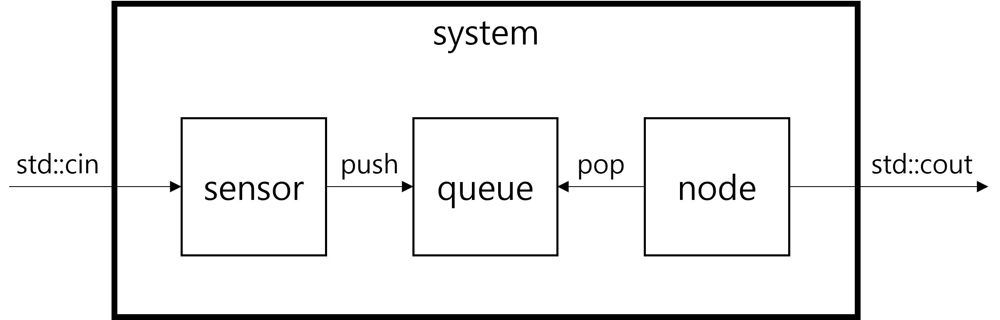
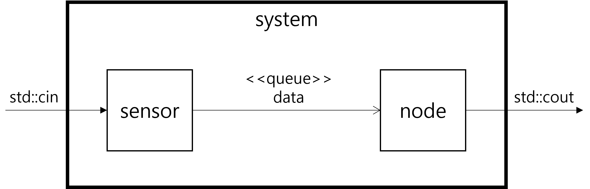

# sensor-node

## Overview

`sensor-node` is a simple C++ program that simulates a sensor node. The program initializes a sensor, continuously polls for data input, and publishes the data to a topic.


Two threads are running concurrently and share data. The created buffer in the circular queue is re-used, so no additional copy is required.

```
$ sensor-node
1
Data processed
2
Data processed
3
Data processed
publish topic - 1
publish topic - 2
publish topic - 3
```

## Design Consideration
In the previous design, since the sensor object was shared between the main-thread and pub-thread, it is easy to make a mistake that causes a racing condition.

In the enhanced design, the main-thread is responsible for processing ROS messages and executing the node component. On the other hand, the sensor-thread acquires data from the sensor and transmits it to the main-thread. The roles of the components are clearly separated (Single Responsibility Principle), and the deployment on threads is also clearly distinguished.

The sensor-thread pushes data to the queue and the main-thread pops data from the queue and processes it. In other words, sharing between threads is only done through the queue. This prevents racing conditions due to simultaneous access between threads.

In the current implementation, the queue protects simultaneous access to head and tail with a mutex. Only the sensor-thread pushes and changes only tail value, and only the main-thread pops and changes only head value, so in this case, there is no problem even if a mutex is not used to lock.

The component & connector view that explains the architecture described above can be drawn as follows.



Here, the queue is a component that provides the way how the sensor and node transmit data, and it is not bad to specify it as a connector. As follows.



The deployment of the components in the thread level is as follows.


As you can see in the figure, the components executed by the threads are clearly separated, and it is also clearly shown that communication between threads goes through only the queue.

## Project Structure

- `CMakeLists.txt`: CMake configuration file for building the project.
- `inc/sensor.hpp`: Header file for the `Sensor` class.
- `inc/SensorNode.hpp`: Header file for the `SensorNode` class.
- `inc/Data.hpp`: Header file for the `Data` class.
- `inc/CircularQueue.hpp`: Header file for the `CircularQueue` template class.
- `src/main.cpp`: Main entry point of the program.
- `src/sensor.cpp`: Implementation of the `Sensor` class.
- `src/SensorNode.cpp`: Implementation of the `SensorNode` class.
- `src/Data.cpp`: Implementation of the `Data` class.

## Building the Project

To build the project, you need to have CMake and a C++ compiler installed. Follow these steps:

1. Create a build directory:
    ```sh
    mkdir build
    cd build
    ```

2. Run CMake to configure the project:
    ```sh
    cmake ..
    ```

3. Build the project:
    ```sh
    cmake --build .
    ```

## Running the Program

After building the project, you can run the executable:

```sh
./sensor-node
```