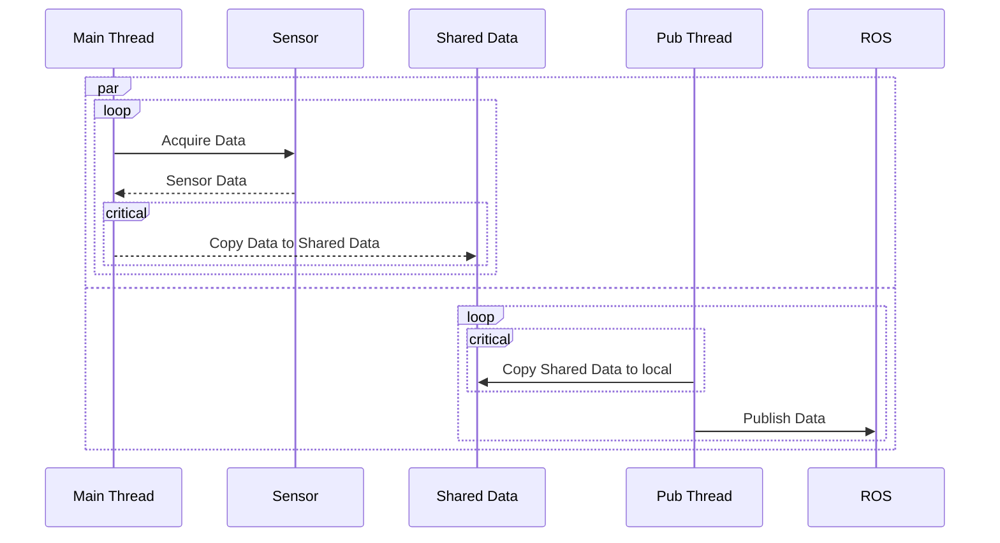
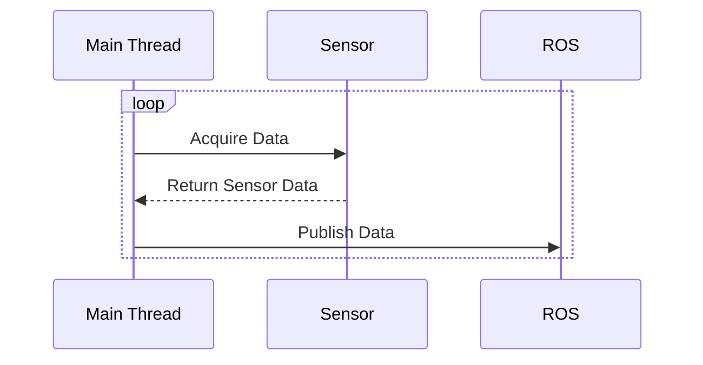
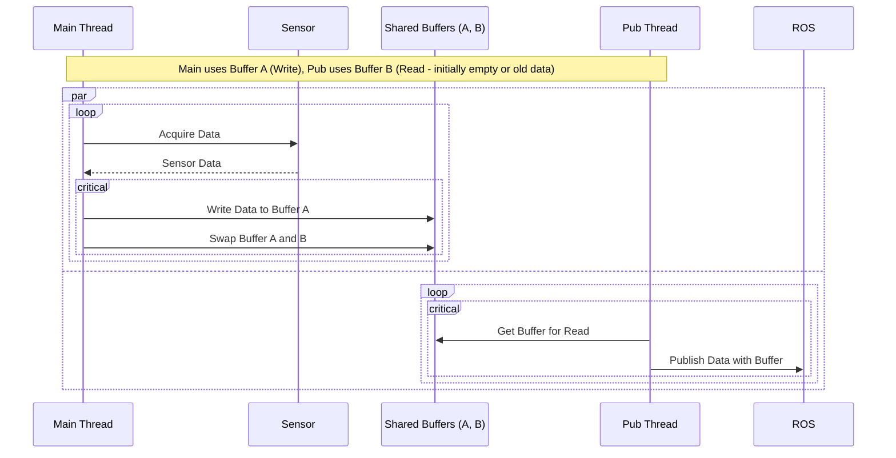
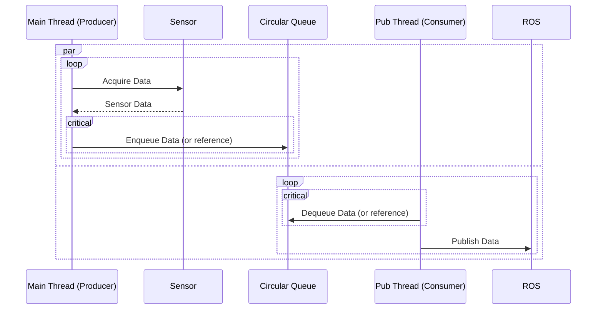

# Enhancing sensor data processing performance

## Problem Statement: Performance Overhead due to Memory Copying

In the existing design([branch: buffer-for-share](https://github.com/bosornd/sensor-node/tree/buffer-for-share)), in order to prevent the main-thread from overwriting the data obtained from the sensor while the pub-thread is using data for publishing a topic, a method of copying to another buffer is used.
The main thread acquires data from a sensor, and a separate publishing thread (pub-thread) is responsible for sending this data. To prevent data corruption issues where the main thread might overwrite the sensor data while the pub-thread is still processing or publishing it([branch: racing-condition](https://github.com/bosornd/sensor-node/tree/racing-condition), a defensive copy mechanism is employed. The main thread copies the latest sensor data into a separate buffer that the pub-thread can safely access.

While this approach ensures data integrity between the threads, the memory copy operation introduces significant performance overhead, especially if the sensor data is large or the data acquisition rate is high. This copying consumes CPU cycles and memory bandwidth, potentially impacting the overall system responsiveness and throughput.

To optimize performance and reduce resource consumption, a zero-copy mechanism is required. A zero-copy approach would allow the pub-thread to access the sensor data directly (or through a shared reference/pointer mechanism) without needing an explicit memory copy, while still guaranteeing thread safety and data consistency. This would eliminate the overhead associated with the current data duplication strategy.
## Design Candidates for Zero-Copy Mechanism

To address the performance overhead caused by memory copying, several design candidates employing zero-copy or reduced-copy strategies are considered:

### Candidate 1: Merging Threads

*   **Concept:** Eliminate concurrency altogether by merging the data acquisition and publishing tasks into a single thread.

*   **Mechanism:** The single thread sequentially performs data acquisition from the sensor and then publishes it. Since there's only one thread accessing the data buffer, there's no risk of concurrent access conflicts, eliminating the need for a separate copy for thread safety.

### Candidate 2: Buffer Swapping (Double Buffering)

*   **Concept:** Maintain two separate buffers. One buffer is actively used by the main thread for writing new sensor data (write buffer), while the other holds the last complete dataset for the pub-thread to read (read buffer).
*   **Mechanism:** When the main thread finishes acquiring a new dataset, it swaps the roles of the two buffers. The previously written buffer becomes the read buffer for the pub-thread, and the previous read buffer becomes the new write buffer. Synchronization (e.g., mutexes, atomic operations) is needed to manage the swap safely.

### Candidate 3: Circular Queue (Ring Buffer)

*   **Concept:** Use a fixed-size circular queue (or ring buffer) to store multiple sensor data entries (or pointers/references to them).
*   **Mechanism:** The main thread (producer) enqueues new data into the buffer. The pub-thread (consumer) dequeues data from the buffer for publishing. The queue manages indices for the head (read position) and tail (write position). Synchronization is required to manage these indices and handle buffer full/empty conditions safely.

## Pros and Cons

### Candidate 1: Merging Threads

*   **Pros:**
    *   Simplest design, eliminates thread synchronization complexity entirely.
    *   Guarantees data consistency as there's no concurrent access.
    *   Minimal memory overhead (only one buffer needed).
*   **Cons:**
    *   Reduces parallelism; the system can only acquire data *or* publish, not both concurrently.
    *   If publishing is slow, it blocks subsequent data acquisition, potentially missing sensor updates (lower effective sample rate).
    *   If data acquisition is slow, it delays publishing.
    *   Not suitable for high-frequency data or time-sensitive publishing requirements.

### Candidate 2: Buffer Swapping (Double Buffering)

*   **Pros:**
    *   Allows concurrent data acquisition and publishing.
    *   Relatively simple synchronization logic (often just swapping pointers/references atomically or under a light lock).
    *   Zero-copy for the pub-thread (it reads directly from the buffer made available to it).
    *   Pub-thread always works with a complete, consistent data set.
*   **Cons:**
    *   Requires double the memory footprint for the sensor data buffers.
    *   If the pub-thread is significantly slower than the main thread, it might repeatedly publish the same (older) data set until the next swap occurs.
    *   A brief lock or atomic operation is still needed for the swap, introducing minimal synchronization overhead.

### Candidate 3: Circular Queue (Ring Buffer)

*   **Pros:**
    *   Effectively decouples the producer (main thread) and consumer (pub-thread) rates.
    *   Handles bursts of data well, smoothing out processing.
    *   Allows the pub-thread to catch up if it falls behind temporarily (up to the queue size).
    *   Can be implemented using lock-free techniques for very high performance in suitable scenarios.
    *   Memory footprint is fixed based on queue size.
*   **Cons:**
    *   More complex synchronization logic compared to double buffering, especially if implementing lock-free queues.
    *   Requires careful handling of buffer full (producer might block or drop data) and buffer empty (consumer must wait) conditions.
    *   Data published might have slightly higher latency compared to the absolute latest data acquired if the queue contains multiple items.
    *   Choosing the right queue size is crucial and depends on expected data rates and processing times.

    ## Comparison Summary

    | Feature                 | Candidate 1: Merging Threads | Candidate 2: Buffer Swapping | Candidate 3: Circular Queue |
    | :---------------------- | :--------------------------- | :--------------------------- | :-------------------------- |
    | **Concurrency**         | None (Sequential)            | High (Parallel Acquisition & Publish) | High (Parallel Producer & Consumer) |
    | **Copy Overhead**       | Zero                         | Zero (for Pub Thread)        | Zero (if storing references) / Minimal (if copying small items) |
    | **Memory Footprint**    | Minimal (1 buffer)           | Double (2 buffers)           | Moderate (N buffers/slots)  |
    | **Synchronization**     | None                         | Low (Swap mechanism)         | Moderate to High (Queue logic, potentially lock-free) |
    | **Data Consistency**    | Guaranteed                   | Guaranteed (Pub uses complete set) | Guaranteed (Pub uses dequeued set) |
    | **Data Latency**        | Potentially High (Blocking)  | Low (Pub uses last complete set) | Low to Moderate (Depends on queue depth) |
    | **Rate Mismatch Handling**| Poor (Blocking)              | Limited (Pub repeats old data) | Good (Buffers mismatches up to queue size) |
    | **Implementation Complexity** | Very Low                   | Low                          | Moderate to High            |
    | **Suitability**         | Low-frequency, non-critical timing | High-frequency, consistent data needed | High-frequency, variable rates, decoupling needed |

    ## Design Outcome

    Based on the analysis of pros, cons, and suitability for handling potentially variable data acquisition and publishing rates while minimizing copy overhead, **Candidate 3: Circular Queue (Ring Buffer)** was selected as the preferred design. This approach offers the best balance of concurrency, decoupling, and efficient resource utilization for the target application, despite its slightly higher implementation complexity compared to the other candidates.

    ## Additional Design Considerations

    ### Granularity of Queue Elements

    A key design decision for the Circular Queue approach is the granularity of the data elements stored within the queue. Two primary options were considered:

    1.  **Storing Individual Scan Points:** The main thread acquires individual scan points from the sensor device and enqueues each point into the circular queue. The pub-thread would then dequeue multiple scan points (potentially up to a full message size) to assemble a complete message before publishing.
    2.  **Storing Complete Messages:** The main thread acquires scan points and accumulates them into a complete message structure (e.g., an array or vector of scan points). Once a full message is ready, the main thread enqueues this entire message object (or a reference/pointer to it) into the circular queue. The pub-thread dequeues a single element (the complete message) and publishes it directly.

    **Context:** The main thread's role is to acquire scan points from the device. These scan points are then grouped into an array, which constitutes the message payload to be published.

    **Decision:** Storing complete messages (Option 2) was chosen. While potentially requiring slightly more complex memory management for the message objects themselves, it simplifies the logic for both the producer (main thread) and the consumer (pub-thread). The main thread handles the message assembly logic, and the pub-thread simply dequeues and publishes ready-made messages. This aligns better with the typical publish/subscribe pattern where discrete messages are handled. Storing individual points would require the pub-thread to manage partial message states and assembly logic, adding complexity to the consumer side.
    Furthermore, the process of aggregating individual scan points into a complete message structure is inherently tied to the specifics of the sensor device and its data output format. Therefore, encapsulating this message assembly logic within the main thread, which is already responsible for interacting directly with the sensor and acquiring the raw scan points, leads to a more cohesive and modular design. The pub-thread can then remain agnostic to the details of message formation, focusing solely on the task of publishing fully formed messages obtained from the queue.