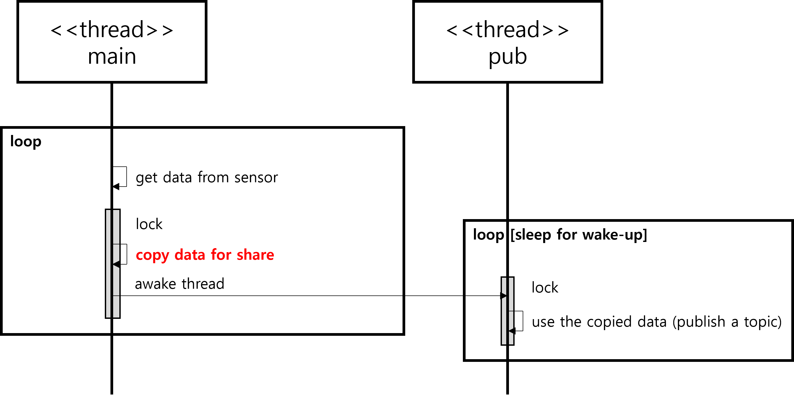
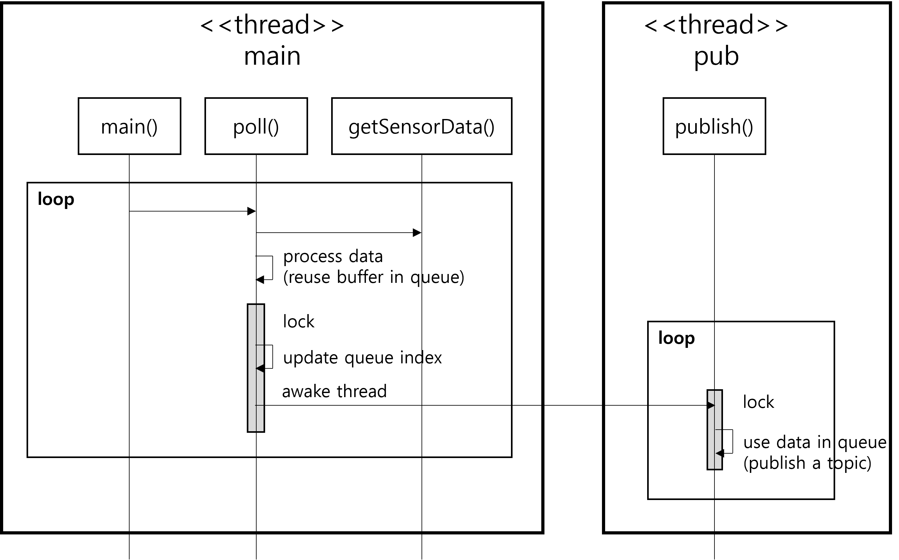

# Use circular queue to remove unnecessary copies

## Context and Problem Statement

In the existing design([branch: buffer-for-share](https://github.com/bosornd/sensor-node/tree/buffer-for-share)), in order to prevent the main-thread from overwriting the data obtained from the sensor while the pub-thread is using data for publishing a topic, a method of copying to another buffer is used.

This data copy can cause performance degradation. In particular, if the data size is large or the frequency is high, it can be fatal to performance. Therefore, it's required to remove unnecessary copies.

## Considered Options

### Option 1. **Merge 2 threads into one**
* A design of directly publishing data acquired from the sensor in the main-thread without using a separate thread for publishing.

### Option 2. **Use circular queue** ([branch: circular-queue](https://github.com/bosornd/sensor-node/tree/circular-queue))
* A design that uses a circular queue to transfer data.
* Buffers in the queue can be reused.

## Decision Outcome

Chosen option: Option 2. **Use circular queue**

It can remove unnecessary copies and enhance the performance to publish the sensored data.

## Pros and Cons of the Options

### Option 1. **Merge 2 threads into one**
* Good for performance. No unnecessary copies!!!
* Weak for flexibility between acquiring the sensor data and publishing the data.

### Option 2. **Use circular queue** ([branch: circular-queue](https://github.com/bosornd/sensor-node/tree/circular-queue))
* Good for performance, No unnecessary copies!!!
* Good for flexibility between acquiring the sensor data and publishing the data.

| Criteria      | Existing Design | Option 1 | Option 2 |
|---------------|-----------------|----------|----------|
| Performance   | - | + | + |
| Flexibility   | + | - | + |

