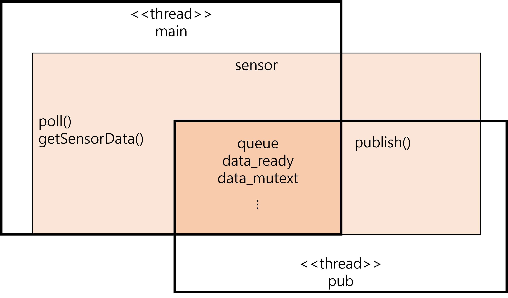
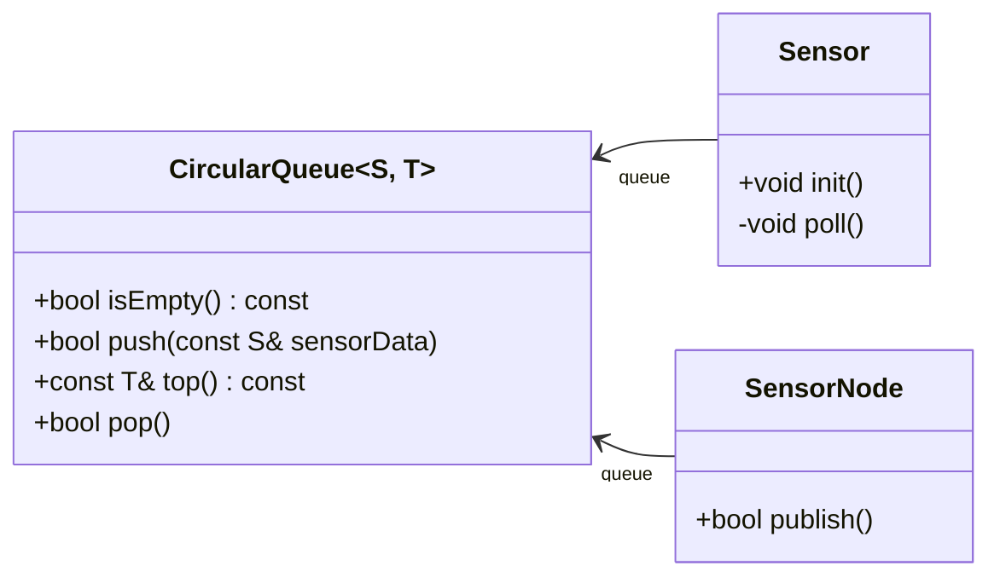

# Clearly separate between sensor and publisher roles

## Context and Problem Statement

In the existing design([branch: buffer-for-share](https://github.com/bosornd/sensor-node/tree/buffer-for-share)), one object (Sensor) is shared between two threads: main-thread and pub-thread.

The main-thread executes poll() and getSensorData() on the sensor object. The pub-thread executes publish() on the sensor object. They share all member variables and functions of the sensor object. This design makes it easier to make mistakes that cause race conditions.

It is recommended to clearly separate roles according to the Single Responsibility Principle (SRP).

## Decision Outcome

The role of acquiring data from sensor and the role of publishing data as a ROS topic are distinguished.

The SensorNode extends rclcpp::Node and the main-thread handles messages as defined in SensorNode. It is responsible for publishing data. (It is not a good design to allocate the publishing role into a separate thread. Using a separate thread from the ROS executer in main can cause racing conditions.)

The Sensor operates as a separate thread, acquires sensor data and transmits it to the SensorNode. CircularQueue is used for data transmission.

No more sharing is allowed between main-thread and sensor-thread.

### Consequences

The components executed by the main-thread and the components executed by the sensor-thread are clearly distinguished and the connector between two threads is clearly defined. There are no more share between threads. As a result, although multiple threads are used, there is almost no possibility of making a mistake that causes a racing condition.

## Additional Design Consideration

In the existing design, the main-thread was designed to retrieve data from the sensor, and the pub-thread was designed to publish the data. However, in this case, the main-thread runs ROS executer to handle ROS messages, and the pub-thread also publishes data through the ROS interface. At this time, there is a possibility that a racing condition may occur between the threads. Therefore, the current design, which prevents the separated sensor thread from accessing ROS and the main-thread publishes data through the ROS interface, can be said to be safer.
