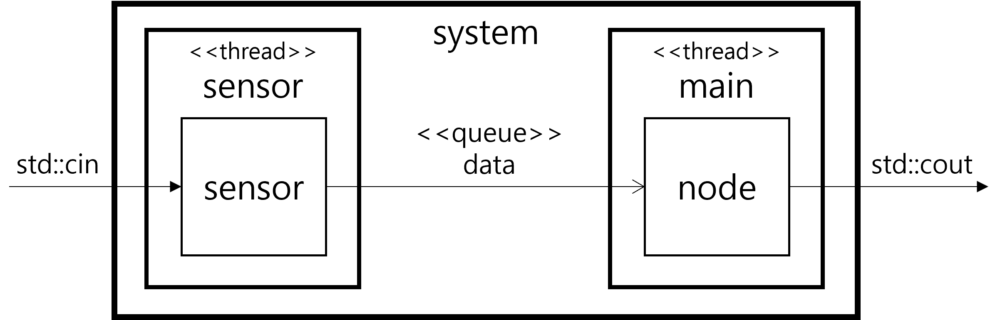
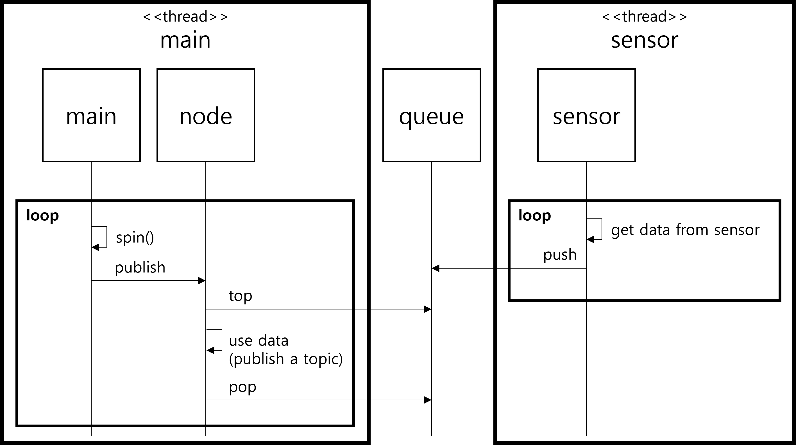

# 센서와 퍼블리셔 역할의 명확한 분리

## 문제 정의

기존 설계([branch: buffer-for-share](https://github.com/bosornd/sensor-node/tree/buffer-for-share))에서는 하나의 객체(Sensor)가 두 스레드 간에 공유됩니다: main-thread와 pub-thread.

main-thread는 센서 객체에서 poll()과 getSensorData()를 실행합니다. pub-thread는 센서 객체에서 publish()를 실행합니다. 두 스레드는 센서 객체의 모든 멤버 변수와 함수를 공유합니다. 이러한 설계는 경쟁 상태(race condition)를 유발하는 실수를 만들기 쉽습니다.

단일 책임 원칙(Single Responsibility Principle, SRP)에 따라 역할을 명확하게 분리하는 것이 좋습니다.

## 설계 결정

센서에서 데이터를 획득하는 역할과 ROS 토픽으로 데이터를 발행하는 역할이 구분됩니다.

* SensorNode는 rclcpp::Node를 확장하며 main-thread는 SensorNode에 정의된 메시지를 처리합니다. 데이터 발행을 담당합니다.
* Sensor는 별도의 스레드로 작동하며, 센서 데이터를 획득하여 SensorNode로 전송합니다.
* 데이터 전송에는 CircularQueue가 사용됩니다. Queue는 스레드 간에 공유되므로 스레드 안전성을 보장합니다.

main-thread와 sensor-thread 간에는 더 이상 공유가 허용되지 않습니다.

### 결과

main-thread에 의해 실행되는 구성 요소와 sensor-thread에 의해 실행되는 구성 요소가 명확하게 구분되고 두 스레드 간의 연결자가 명확하게 정의됩니다. 스레드 간에 더 이상 공유가 없습니다. 결과적으로 여러 스레드가 사용되지만 경쟁 상태를 유발하는 실수를 할 가능성이 거의 없습니다.

## 추가 고려 사항

기존 설계에서는 main-thread가 센서에서 데이터를 획득하도록 설계되었고, pub-thread가 데이터를 발행하도록 설계되었습니다. 이 경우 main-thread는 ROS 메시지를 처리하기 위해 ROS Executor를 실행하고, pub-thread도 ROS 인터페이스를 통해 데이터를 발행합니다. 공유 코드를 사용함으로써 스레드 간에 경쟁 상태가 발생할 가능성이 있습니다. 따라서 분리된 센서 스레드가 ROS에 접근하는 것을 방지하고 main-thread가 ROS 인터페이스를 통해 데이터를 발행하는 현재 설계가 더 안전하다고 할 수 있습니다.
